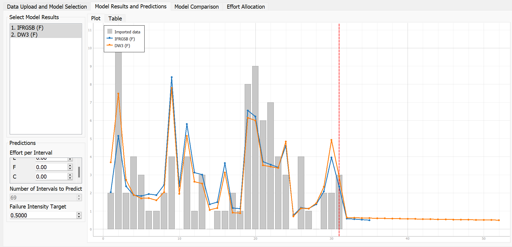

****SENG 637 - Dependability and Reliability of Software Systems****

**Lab. Report \#5 – Software Reliability Assessment**

| Group \#: 08       |   |
|-----------------   |---|
| Student Names:     |   |
|Srujan Patel        |   |
|Jairath Chopra      |   |
|Mit Patel           |   |
|Dishantkumar Patel  |   |

# demo link
https://drive.google.com/file/d/1DuTgCOnqzzccxzqXZAIDHbfJMRNNTKwz/view?usp=sharing
# Introduction
Reliability growth testing:
The purpose of reliability growth testing is to evaluate existing reliability, find and eliminate problems, and estimate future reliability. To track progress, the reliability numbers are compared to intermediate reliability objectives. This allows resources to be directed toward meeting the reliability goals in a timely and cost-effective manner. When a failure occurs, remedial action is conducted to eliminate the source of the problem. For Hardware growth testing is the practise of putting equipment through its paces in both natural and artificial environments.  To ensure that all latent failure modes and mechanisms are discovered, environmental factors must be studied. Problems with performance, design, and the environment have been resolved.

The earliest prototypes created during the creation of a new complex system will almost always have design, manufacturing, and/or engineering flaws. Because of these flaws, the prototypes' initial dependability may fall short of the system's reliability target or need. Prototypes are frequently subjected to a rigorous testing programme in order to uncover and correct these flaws. Problem areas are detected during testing, and suitable corrective actions are implemented. The improvement in the dependability of a product over time owing to changes in the product's design and/or manufacturing process is known as reliability growth.

Reliability demonstration chart:

To ensure that a certain degree of dependability has been achieved, reliability demonstration is used near the end of the growth testing period. The software code is frozen during a demonstration test, precisely as it would be in the field.
The Automatic Detailed Dependability Report's goal is to give you the tools you need to assess the reliability and criticality of a system, production line, or facility, as well as precise evaluations of the equipment it contains. In other words, in addition to providing system-level indicators and graphs, it also allows the user to go deeper into the line by analysing specific downstream equipment indicators.

Analyze the System In this section of the module, the following analyses are highlighted: Graph of system availability and effective utilisation, graph of system MTBF and MTTR, graph of system Pareto by hours and quantity, graph of system OEE, jackknife graph of system failure mechanisms, and jackknife graph for chosen downstream equipment Table of System Reliability Indicators.
Analyze the downstream equipment in detail. This section includes the following analysis for "n" pieces of equipment chosen, either downstream in the system or in the initial line: Availability and effective utilisation graph for the nth piece of equipment, Pareto failure modes graph for the nth piece of equipment, jackknife failure mode graph for the nth piece of equipment, table showing details of interruptions in the nth piece of equipment, and table showing reliability indicators for the nth piece of equipment.

# Assessment Using Reliability Growth Testing 

Firstly, we imported the given data failure-data-a5 to C-SFRAT tool. Next, to conduct  Growth Testing we plotted all the models on all the covariates (e,f,c) to get an overall view before further analysis. 

We made a selection of all the hazard functions available in C-SFRAT namely:

- IFR Salvia & Bollinger
- IFR Generalized Salvia & Bollinger
- S Distribution
- Discrete Weibull (Order 2)
- Discrete Weibull (Type III)
- Geometric
- Negative Binomial (order 2)
- Truncated Logistic

The resulting plot is shown below:

The intensity plot shown below for the same data can be inferred using Ctrl+I shortcut.

The model comparision based on their best fit using the model comaprison tool in C-SFRAT with equal metric weights of 1.0 each for LLF,AIC,BIC,SSE values is displayed below:

From the table it can be inferred that the top two models are the discrete weibull type 3 on covariate F having a 1.0 critic for mean and median and the IFRGSB on covariate F having 0.998 critic for mean and median. A comparision of these two models is shown below:

Intensity Plot

The graph shown below shows that it is a relatively declining or plateauing curve for the IFRGSB on covariate F. This indicates failure in reliability growth, since the amounts of failures starts to happen more and more as time increases. Therefore, the system does not exhibit reliability growth, as the failures over time intervals is predicted by C-SFRAT to be plateauing, and finally reaches zero at the 100th interval.

The graph for the DW3 model on covariate F indicates that there is steady realibikity growth, since the amounts of failures starts to happen less and less as time increases, measured for the next 69 intervals.

From the failure intensity graph of both the models it can be inferred that the that the failure intensity is quite large and does not show promise in hitting the 1.0 target (default value in the tool). We adjusted the target failure intensity to 0.5 as such: 

As a result, C-SFRAT implies that both models are likely to meet the new failure intensity rate target of 0.5. At an interval of 52, the DW3 model will reach the target failure intensity rate, while the IFRGSB will be around 34. As a result, a target failure intensity rate range of 0.6 or below is appropriate, whereas anything approaching 1.0 or higher is excessive for both the models.
# Assessment Using Reliability Demonstration Chart 

In the Reliability Demonstration Chart, the values of cumulative failures are plotted against the cumulative execution time (E) of the given data. The values of discrimination ratio, consumer risk, and supplier risk are 2, 10%, and 10% respectively.  The value of MTTF is obtained by calculating the average value of the execution time interval and its inverse gives the value of failure intensity.

- λ_f= 0.6

- λ_f= 1.2

- λ_f= 0.3

The following observations are made by RDC,

For λ_f= 0.6 the curve ends up in the continue region. So, more testing is required to draw any conclusions regarding the SUT.
For λ_f= 1.2 the curve ends in the accept region which indicates that the target specifications is achieved.
For λ_f= 0.3 the curve ends up in the reject zone which implies that the target specifications are not achieved.

Analysis using a Reliability Demonstration Chart is both time and cost-efficient way of demonstration of the reliability of the system. However, it does not assign a numerical value to the reliability. It only shows the trend of changes and their effect on system’s reliability.

# Comparison of Results
After completing the testing on the two reliability assessment tools, we discovered that the desired failure rates are depicted differently by both tools. Both RDC  and C-SFART passed the reliability testing since the target failure rates were greater than the system's failure intensity objective. Both are giving an average intensity rate of 0.6

# Discussion on Similarity and Differences of the Two Techniques

Through reliability growth analysis the trend of the system's relability can be determined and whether or not this is an acceptable goal given the failure data. RDC analysis is very versatile, time and cost efficient way of analyzing the reliability of a system. A disadvantage of the RDC is that it cannot be used to calculate the exact quantitative value for the reliability (or availability) of the system under study RDC can only indicate that the SUT is acceptable or not.
# How the team work/effort was divided and managed
The team work was divided into two pairs. Srujan and Jairath did the part one, while Dishantkumar and Mit did part two. Everyone contributed in making the report.
# Difficulties encountered, challenges overcome, and lessons learned

Getting the lab tools to work at all was one of the challenges. The application notified us that the failed set I was using for data import was in the improper format. The applications would not work at all for some members of the group, or the failure dataset would not be allowed to be imported. Overall, the lab was tough to comprehend, little confusing.

# Comments/feedback on the lab itself
This lab examines program reliability testing using failure data and a variety of testing techniques. We looked at reliability growth testing and reliability assessment with a reliability demonstration chart in particular. This lab also allowed us to compare multiple reliability evaluations to examine the benefits and drawbacks of each and improve our future tool usage decisions.